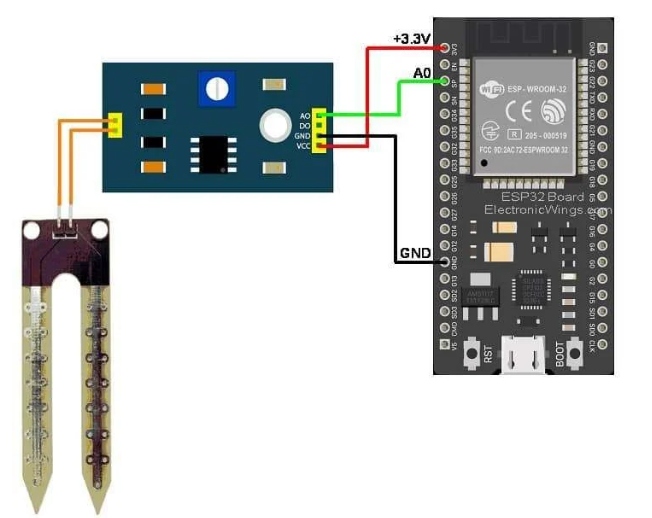

# 🌱 Soil Moisture Monitoring System (ESP32)

This project implements a **soil moisture monitoring system** using a soil moisture sensor and ESP32 DevKit V1. It measures the water content in soil and provides real-time data for irrigation decisions.This system is useful for **smart agriculture and plant monitoring applications**.

---

## 🎯 Objectives

* To measure soil moisture level
* To interface soil moisture sensor with ESP32
* To monitor water content in real-time
* To build a basic smart irrigation system

---

## ⚙️ Components Used

* ESP32 DevKit V1
* Soil Moisture Sensor
* Breadboard
* Jumper Wires

---

## 🔧 Working Principle

The soil moisture sensor measures the conductivity of the soil, which varies based on water content.

* Wet soil → Low resistance → Higher conductivity
* Dry soil → High resistance → Lower conductivity

The sensor outputs an analog signal that is read by ESP32.
The ESP32 processes this signal and converts it into a moisture percentage.

---

## 🔄 System Flow

Soil Sensor → ESP32 → Analog Data Processing → Moisture Level Output

---

## 💻 Arduino Code

```cpp id="soilcode"
const int sensorPin = 34;

void setup() {
  Serial.begin(9600);
}

void loop() {
  int value = analogRead(sensorPin);
  int moisture = map(value, 0, 4095, 0, 100);

  Serial.print("Soil Moisture: ");
  Serial.print(moisture);
  Serial.println("%");

  delay(1000);
}
```

---

## 🔌 Wiring / Circuit Connections

### 🌱 Soil Moisture Sensor

| Sensor Pin | ESP32 Connection |
| ---------- | ---------------- |
| VCC        | 3.3V             |
| GND        | GND              |
| AO         | GPIO 34          |

---

## 📊 Features

* Real-time soil moisture monitoring
* Simple and low-cost system
* Easy to implement
* Useful for agriculture

---

## ✅ Applications

* Smart irrigation systems
* Plant monitoring
* Greenhouse automation
* Agriculture technology

---

## ⚠️ Limitations

* Sensor corrosion over time
* Requires calibration for accuracy
* Affected by soil type

---

## 🚀 Future Enhancements

* 💧 Automatic water pump control
* 📱 IoT monitoring using ESP32 WiFi
* 📊 Cloud data logging
* 🌿 Multi-sensor system

---

## 📸 Wiring Diagram



---

## 📚 Learning Outcomes

* Analog sensor interfacing
* ESP32 ADC usage
* Real-time monitoring
* Embedded system design

---

## 📚 Conclusion

This project demonstrates a simple soil moisture monitoring system using ESP32.
It can be extended into a smart irrigation system for efficient water usage.

